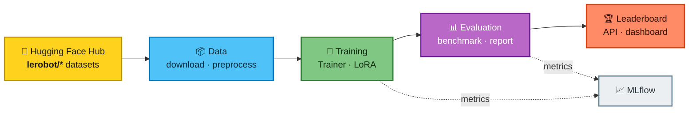

<div align="center">

# 🤖 VLA-Eval

### Train, benchmark and rank **Vision-Language-Action** robotics policies — end to end.

[](.github/workflows/ci.yml)
[](tests/)
[](pyproject.toml)
[](pyproject.toml)

[](pyproject.toml)
[](https://pytorch.org/)
[](https://fastapi.tiangolo.com/)
[](https://react.dev/)
[](https://mlflow.org/)
[](docker-compose.yml)
[](deploy/k8s)
[](https://huggingface.co/lerobot)
[](LICENSE)

</div>

**VLA-Eval** automates dataset acquisition, preprocessing, training/fine-tuning, benchmarking, experiment tracking, reporting, and leaderboard publishing for models such as [OpenVLA](https://openvla.github.io/) and [LeRobot](https://github.com/huggingface/lerobot) policies (ACT, Diffusion Policy, VQ-BeT, TD-MPC). It runs on **real robot datasets** from the Hugging Face Hub.

```bash
cp .env.example .env && docker compose up -d --build
```

| | Service | URL |
| :--: | --- | --- |
| 🎛️ | **Dashboard** | http://localhost:8080 |
| 📘 | **API docs (Swagger)** | http://localhost:8000/api/docs |
| 📈 | **MLflow** | http://localhost:5000 |
| 📊 | **Grafana** | http://localhost:3000 |

---

## Table of Contents

- [Features](#features)
- [Architecture](#architecture)
- [Datasets & Models](#datasets--models)
- [Quickstart](#quickstart)
  - [Docker Compose (recommended)](#docker-compose-recommended)
  - [Local development](#local-development)
- [CLI Usage](#cli-usage)
- [API Usage](#api-usage)
- [Configuration](#configuration)
- [Testing](#testing)
- [Deployment](#deployment)
- [Documentation](#documentation)
- [Contributing](#contributing)
- [Security](#security)
- [License](#license)

## Features

| | Capability | What you get |
| :--: | --- | --- |
| 📦 | **Dataset management** | Curated registry of public robotics datasets (PushT, ALOHA, xArm, BridgeData V2, Berkeley UR5) from the HF Hub, with download, caching, preprocessing and revision pinning |
| 🧠 | **Model zoo** | Pluggable registry: CPU baseline CNN, OpenVLA (4-bit + LoRA), LeRobot ACT & Diffusion Policy |
| 🎯 | **Training** | `Trainer` with AdamW + OneCycleLR, early stopping, checkpointing, full [MLflow](https://mlflow.org/) tracking |
| 📊 | **Evaluation** | Open-loop and closed-loop benchmarks, composite scoring, auto-generated Markdown reports with charts |
| 🏆 | **Leaderboard** | Ranked, filterable, database-backed — exposed via API and the React dashboard |
| 🔌 | **API** | Versioned FastAPI backend, API-key + JWT auth, Prometheus metrics, structured logs, async job orchestration |
| 🎛️ | **Frontend** | React + TypeScript + Vite dashboard for datasets, jobs and the leaderboard |
| ⚙️ | **Experiment configs** | Hydra/OmegaConf composition with multirun sweep support |
| 🚀 | **Production ops** | Docker Compose stack (Postgres, Redis, MLflow, Prometheus, Grafana), Kubernetes/Kustomize overlays, GitHub Actions CI/CD |

## Architecture

A five-stage pipeline: pull real robot data → train a policy → benchmark it → publish to the leaderboard.



<table>
<tr>
<td width="33%" valign="top">

### 🖥️ Interfaces
`React dashboard` · `Typer CLI` · `REST API`

Submit jobs from the browser, the terminal, or `curl`.

</td>
<td width="33%" valign="top">

### ⚙️ Core engine
`data` · `models` · `training` · `evaluation`

Pure Python, no framework lock-in. Swap models via a registry key.

</td>
<td width="33%" valign="top">

### 💾 State
`PostgreSQL` · `MLflow` · `HF Hub`

Jobs and leaderboard persist; runs and artifacts tracked.

</td>
</tr>
</table>

<details>
<summary><b>🔍 How a training job flows through the system</b></summary>

| # | Stage | What happens |
| --- | --- | --- |
| 1 | **Submit** | `POST /api/v1/training/jobs` → a `Job` row is persisted as `PENDING` |
| 2 | **Claim** | API thread pool or a standalone worker atomically claims it (`SELECT … FOR UPDATE SKIP LOCKED` on Postgres) |
| 3 | **Prepare** | Dataset downloaded/cached from the HF Hub, preprocessed, split train/val |
| 4 | **Train** | `Trainer.fit()` — AdamW + OneCycleLR, early stopping, checkpointing |
| 5 | **Track** | Params, per-epoch metrics and artifacts stream to MLflow |
| 6 | **Evaluate** | Benchmark produces a 0–100 composite score + Markdown report |
| 7 | **Publish** | Leaderboard row upserted; job marked `SUCCEEDED` with its result payload |

Because job state lives in the database, progress survives an API restart and any number of workers can scale independently. Full detail in [docs/architecture.md](docs/architecture.md).

</details>

<details>
<summary><b>📂 Repository layout</b></summary>

| Path | Contents |
| --- | --- |
| [src/vla_eval/core/](src/vla_eval/core) | Settings, structured logging, exceptions |
| [src/vla_eval/data/](src/vla_eval/data) | Dataset registry, download, transforms, preprocessing |
| [src/vla_eval/models/](src/vla_eval/models) | Model interface + baseline / OpenVLA / LeRobot |
| [src/vla_eval/training/](src/vla_eval/training) | Trainer, LoRA, callbacks, MLflow integration |
| [src/vla_eval/evaluation/](src/vla_eval/evaluation) | Benchmarks, metrics, leaderboard, reports |
| [src/vla_eval/api/](src/vla_eval/api) | FastAPI app, routers, DB models, services, security |
| [src/vla_eval/cli/](src/vla_eval/cli) | Typer CLI entrypoint |
| [configs/](configs) | Hydra configs (dataset / model / training / evaluation) |
| [scripts/](scripts) | Hydra entry points for training & evaluation |
| [frontend/](frontend) | React + Vite + TypeScript dashboard |
| [tests/](tests) | Unit + integration tests (pytest) |
| [docker/](docker) | Per-service Dockerfiles + supporting configs |
| [deploy/k8s/](deploy/k8s) | Kustomize base + staging/production overlays |
| [migrations/](migrations) | Alembic database migrations |
| [.github/](.github) | CI/CD workflows, issue/PR templates, Dependabot |

</details>


## Datasets & Models

### Where the data comes from

All datasets are **real, publicly available robot-learning datasets downloaded at runtime from the [Hugging Face Hub](https://huggingface.co/), under the [`lerobot`](https://huggingface.co/lerobot) organization** — the standardized dataset collection maintained by the Hugging Face [LeRobot](https://github.com/huggingface/lerobot) project. They contain synchronized camera frames, proprioceptive state, and action trajectories recorded on physical robots and in simulators.

- **Source of truth:** `https://huggingface.co/datasets/lerobot/<name>`
- **No data is vendored in this repository** — nothing is committed to git. Datasets are fetched on demand into `./data/cache/` (override with `--cache-dir`).
- **Not sourced from Kaggle**, scraped websites, or ad-hoc CSV dumps.
- Several entries originate from the [Open X-Embodiment](https://robotics-transformer-x.github.io/) collection (BridgeData V2, Berkeley AUTOLAB UR5), re-published in LeRobot format.
- The registry lives in [src/vla_eval/data/registry.py](src/vla_eval/data/registry.py); download logic in [src/vla_eval/data/datasets.py](src/vla_eval/data/datasets.py).

| Registry name | Hub repo | Robot / task | Action dim | Type | License |
| --- | --- | --- | :--: | :--: | :--: |
| `pusht` | [`lerobot/pusht`](https://huggingface.co/datasets/lerobot/pusht) | Push a T-block to a target pose | 2 |  | MIT |
| `aloha_sim_insertion_human` | [`lerobot/aloha_sim_insertion_human`](https://huggingface.co/datasets/lerobot/aloha_sim_insertion_human) | ALOHA bimanual peg insertion | 14 |  | MIT |
| `aloha_sim_transfer_cube_human` | [`lerobot/aloha_sim_transfer_cube_human`](https://huggingface.co/datasets/lerobot/aloha_sim_transfer_cube_human) | ALOHA bimanual cube transfer | 14 |  | MIT |
| `xarm_lift_medium` | [`lerobot/xarm_lift_medium`](https://huggingface.co/datasets/lerobot/xarm_lift_medium) | xArm lifting (medium difficulty) | 4 |  | MIT |
| `berkeley_autolab_ur5` | [`lerobot/berkeley_autolab_ur5`](https://huggingface.co/datasets/lerobot/berkeley_autolab_ur5) | UR5 tabletop manipulation | 7 |  | CC-BY-4.0 |
| `bridge_orig` | [`lerobot/bridge_orig`](https://huggingface.co/datasets/lerobot/bridge_orig) | BridgeData V2, multi-kitchen manipulation | 7 |  | CC-BY-4.0 |
| `synthetic` | _(generated in-process)_ | Deterministic fixture for CI / offline runs | 7 |  | — |

Downloads go through `lerobot` when installed, falling back to a `huggingface_hub` snapshot download otherwise — both support **revision pinning** (`revision=` / commit SHA) for reproducibility. Gated or private repos need `HF_TOKEN` set in your `.env`. Add your own datasets with a single `register_dataset(DatasetSpec(...))` call; no other code changes needed.

### Models

| Model key | Backbone | Notes |
| --- | --- | --- |
| `baseline-cnn` | CNN encoder + MLP head | CPU-friendly reference policy; used by tests and smoke runs |
| `openvla` | [OpenVLA-7B](https://huggingface.co/openvla/openvla-7b) | 4-bit quantization + LoRA fine-tuning; needs a CUDA GPU |
| `lerobot-act` | LeRobot ACT | Action-chunking transformer |
| `lerobot-diffusion` | LeRobot Diffusion Policy | Diffusion-based visuomotor policy |

Model weights are likewise pulled from the Hugging Face Hub on first use and cached under `HF_HOME` — none are committed to this repository.

```bash
vla-eval data list      # print the live registry as a table
```

## Quickstart

### Docker Compose (recommended)

Brings up Postgres, Redis, MLflow, the API, the background worker, the frontend, Prometheus, and Grafana.

```bash
cp .env.example .env          # edit secrets/config as needed
docker compose up -d --build
```

- Frontend dashboard: http://localhost:8080
- API docs (Swagger UI): http://localhost:8000/api/docs
- MLflow UI: http://localhost:5000
- Grafana: http://localhost:3000 (Prometheus datasource pre-provisioned)

### Local development

<details>
<summary><b>Set up a local Python environment</b></summary>

> **Note (Windows):** numpy 1.26.x has a known incompatibility with Python 3.13 on Windows (`OverflowError` during `numpy` import). Use `numpy>=2.1` (already the default constraint in `pyproject.toml`) or Python 3.11/3.12 if you hit this.

```bash
python -m venv .venv
# Windows: .venv\Scripts\activate    |    macOS/Linux: source .venv/bin/activate

# Install CPU-only torch first (much smaller/faster than the default CUDA wheel)
pip install torch --index-url https://download.pytorch.org/whl/cpu

pip install -e ".[dev]"
pre-commit install

# Run the API (SQLite by default outside Docker; set DATABASE_URL to override)
make run-api

# In another shell: run the frontend
cd frontend && npm install && npm run dev
```

</details>

<details open>
<summary><b>Try it in 60 seconds (no downloads required)</b></summary>

The built-in `synthetic` dataset lets you exercise the full train → evaluate → report pipeline offline. Training/evaluation log to MLflow at `MLFLOW_TRACKING_URI` (defaults to `http://localhost:5000`); either run `mlflow server` locally, or point it at a local SQLite file for a zero-dependency run:

```bash
# macOS/Linux
export MLFLOW_TRACKING_URI=sqlite:///./mlruns.db
# Windows PowerShell
$env:MLFLOW_TRACKING_URI="sqlite:///./mlruns.db"

vla-eval data list                                       # 1. see the dataset registry
vla-eval train --dataset synthetic --model baseline-cnn --epochs 1   # 2. train
vla-eval evaluate --dataset synthetic --model baseline-cnn           # 3. benchmark + report
```

Step 3 writes a Markdown report with metrics and charts to `./reports/generated/`.

</details>

<details>
<summary><b>Train on a real robotics dataset</b></summary>

```bash
vla-eval data download pusht          # pulls lerobot/pusht from the HF Hub
vla-eval data preprocess pusht
vla-eval train --dataset pusht --model baseline-cnn --epochs 20
vla-eval evaluate --dataset pusht --model baseline-cnn
```

For gated/private repos, set `HF_TOKEN` in your `.env`. Larger real-robot datasets (`bridge_orig`, `berkeley_autolab_ur5`) are hundreds of GB — use `--max-episodes` during preprocessing to work with a subset.

</details>

## CLI Usage

The `vla-eval` console script (installed via `pip install -e .`) exposes:

```bash
vla-eval data list                    # list registered public datasets
vla-eval data download pusht          # download + cache a dataset
vla-eval data preprocess pusht        # preprocess into training-ready format

vla-eval train --dataset pusht --model baseline-cnn      # train/fine-tune a model
vla-eval evaluate --dataset pusht --model baseline-cnn   # run the benchmark suite + report

vla-eval serve                        # run the FastAPI backend (uvicorn)
```

Every command supports `--help`. For full experiment-config control (sweeps, overrides), use the Hydra scripts directly:

```bash
python scripts/train.py model=openvla_lora training=lora_finetune dataset=pusht
python scripts/train.py -m training.learning_rate=1e-4,5e-5   # multirun sweep
python scripts/evaluate.py model=baseline dataset=pusht
```

## API Usage

All endpoints are versioned under `/api/v1` and (except `/healthz`, `/readyz`, `/metrics`) require an `X-API-Key` header. Interactive OpenAPI docs live at **`/api/docs`** (Swagger) and **`/api/redoc`** (ReDoc) — the fastest way to explore and try requests in the browser.

<details open>
<summary><b>📡 Endpoint map</b></summary>

| Method | Path | Purpose |
| --- | --- | --- |
| `GET` | `/api/v1/datasets` | List the dataset registry |
| `GET` | `/api/v1/datasets/{name}` | Dataset metadata |
| `POST` | `/api/v1/datasets/{name}/download` | Kick off a background download |
| `GET` | `/api/v1/models` | List available models |
| `POST` | `/api/v1/training/jobs` | Submit a training job |
| `GET` | `/api/v1/training/jobs/{id}` | Poll job status |
| `POST` | `/api/v1/evaluation/jobs` | Submit an evaluation job |
| `GET` | `/api/v1/leaderboard` | Ranked results |
| `POST` | `/api/v1/auth/token` | Exchange an API key for a JWT |
| `GET` | `/healthz` · `/readyz` · `/metrics` | Health probes & Prometheus |

</details>

<details>
<summary><b>💻 curl examples</b></summary>

```bash
export API_KEY=dev-local-api-key-change-me   # from your .env

# List datasets
curl -H "X-API-Key: $API_KEY" http://localhost:8000/api/v1/datasets

# Submit a training job
curl -X POST -H "X-API-Key: $API_KEY" -H "Content-Type: application/json" \
  -d '{"dataset_name": "pusht", "model_name": "baseline-cnn", "num_epochs": 10}' \
  http://localhost:8000/api/v1/training/jobs

# Poll job status
curl -H "X-API-Key: $API_KEY" http://localhost:8000/api/v1/training/jobs/<job_id>

# Leaderboard
curl -H "X-API-Key: $API_KEY" http://localhost:8000/api/v1/leaderboard
```

</details>

## Configuration

All runtime settings are environment-variable driven via `pydantic-settings` (`vla_eval.core.config.Settings`). See [.env.example](.env.example) for the full list (app/API settings, database URL, MLflow tracking URI, Hugging Face token, S3/object storage, Redis, training defaults, frontend base URL).

Experiment configuration (datasets/models/training/evaluation hyperparameters) is composed via Hydra from [configs/config.yaml](configs/config.yaml) and the `configs/{dataset,model,training,evaluation}/` groups — see [docs/training-guide.md](docs/training-guide.md).

## Testing

Every check below runs in CI on each push and pull request.

| Check | Command | Status |
| --- | --- | :--: |
| Unit + integration tests | `pytest` |  |
| Coverage | `pytest --cov=vla_eval --cov-report=term-missing` |  |
| Lint | `ruff check src tests` |  |
| Format | `black --check src tests` |  |
| Types | `mypy src` |  |
| Security | `bandit -c pyproject.toml -r src` |  |
| Frontend | `cd frontend && npm test` |  |

Or run everything at once with `make check`.

## Deployment

| Target | How | Guide |
| --- | --- | --- |
| 🐳 **Docker Compose** | `docker compose up -d --build` | [docs/deployment.md](docs/deployment.md) |
| ☸️ **Kubernetes (staging)** | `kubectl apply -k deploy/k8s/overlays/staging` | [docs/deployment.md](docs/deployment.md) |
| ☸️ **Kubernetes (production)** | `kubectl apply -k deploy/k8s/overlays/production` | [docs/deployment.md](docs/deployment.md) |

## Documentation

| Doc | Covers |
| --- | --- |
| 🏗️ [docs/architecture.md](docs/architecture.md) | System design, module responsibilities, data flow |
| 🎓 [docs/training-guide.md](docs/training-guide.md) | Datasets, model configs, LoRA fine-tuning, MLflow |
| 🔌 [docs/api-reference.md](docs/api-reference.md) | REST API endpoints and authentication |
| 🚀 [docs/deployment.md](docs/deployment.md) | Docker Compose and Kubernetes deployment |
| 🤝 [CONTRIBUTING.md](CONTRIBUTING.md) | Development workflow and code style |
| 🔒 [SECURITY.md](SECURITY.md) | Vulnerability reporting and security practices |

## Contributing

Contributions are welcome — see [CONTRIBUTING.md](CONTRIBUTING.md) for the development setup, coding standards, and pull request process.

## Security

See [SECURITY.md](SECURITY.md) for the vulnerability disclosure policy and an overview of the security controls used throughout the platform (secret handling, safe model deserialization, auth, dependency/image scanning).

## License

Licensed under the [Apache License 2.0](LICENSE).

---

<div align="center">

Built with 🤗 [LeRobot](https://github.com/huggingface/lerobot) datasets · [OpenVLA](https://openvla.github.io/) · [PyTorch](https://pytorch.org/) · [FastAPI](https://fastapi.tiangolo.com/) · [MLflow](https://mlflow.org/)

⭐ **Star this repo** if it helps your robot-learning work.

</div>
