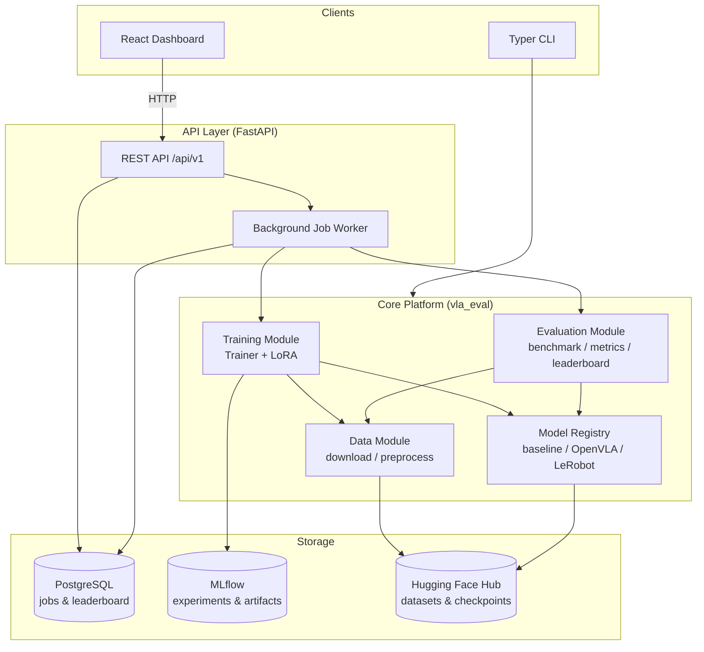

# VLA-Eval

**VLA-Eval** is a production-grade evaluation and training platform for Vision-Language-Action (VLA) robotics models. It automates dataset acquisition, preprocessing, training/fine-tuning, benchmarking, experiment tracking, reporting, and leaderboard publishing for models such as [OpenVLA](https://openvla.github.io/) and [LeRobot](https://github.com/huggingface/lerobot) policies (ACT, Diffusion Policy, VQ-BeT, TD-MPC).

[](.github/workflows/ci.yml)
[](LICENSE)
[](pyproject.toml)
[](tests/)
[](pyproject.toml)
[](pyproject.toml)

> **TL;DR** — `cp .env.example .env && docker compose up -d --build` → dashboard on **:8080**, API docs on **:8000/api/docs**, MLflow on **:5000**.

---

## Table of Contents

- [Features](#features)
- [Architecture](#architecture)
- [Datasets & Models](#datasets--models)
- [Quickstart](#quickstart)
  - [Docker Compose (recommended)](#docker-compose-recommended)
  - [Local development](#local-development)
- [CLI Usage](#cli-usage)
- [API Usage](#api-usage)
- [Configuration](#configuration)
- [Testing](#testing)
- [Deployment](#deployment)
- [Documentation](#documentation)
- [Contributing](#contributing)
- [Security](#security)
- [License](#license)

## Features

- **Dataset management** — curated registry of public robotics datasets (PushT, ALOHA sim, xArm, Bridge, Berkeley UR5) sourced from the Hugging Face Hub / LeRobot, with automatic download, caching, and preprocessing.
- **Model zoo** — pluggable model registry supporting a lightweight CNN baseline, OpenVLA (with 4-bit quantization + LoRA), and LeRobot policies (ACT, Diffusion Policy).
- **Training** — configurable `Trainer` with AdamW + OneCycleLR, early stopping, checkpointing, and full [MLflow](https://mlflow.org/) experiment tracking.
- **Evaluation & benchmarking** — offline (open-loop) and closed-loop simulator benchmarks, composite scoring, and auto-generated Markdown reports with charts.
- **Leaderboard** — ranked, filterable leaderboard backed by a persistent database, exposed via API and a React dashboard.
- **API** — versioned FastAPI backend with API-key + JWT auth, Prometheus metrics, structured logging, and async job orchestration (training/evaluation run in a background worker).
- **Frontend** — React + TypeScript + Vite dashboard for datasets, training jobs, evaluation jobs, and the leaderboard.
- **Experiment configs** — Hydra/OmegaConf-driven configuration composition for datasets, models, training, and evaluation.
- **Production-ready ops** — Docker images for every service, Docker Compose stack (Postgres, Redis, MLflow, Prometheus, Grafana), Kubernetes/Kustomize manifests for staging & production, and GitHub Actions CI/CD (lint, type-check, tests, security scanning, image builds, deployment).

## Architecture



**Repository layout:**

```
src/vla_eval/
  core/         # settings, logging, exceptions, shared utils
  data/         # dataset registry, download, transforms, preprocessing
  models/       # model interface + baseline/OpenVLA/LeRobot implementations
  training/     # Trainer, LoRA, MLflow integration, callbacks
  evaluation/   # benchmarking, metrics, leaderboard, report generation
  api/          # FastAPI app, routers, DB models, services, security
  cli/          # Typer CLI entrypoint
scripts/        # Hydra entry points for training/evaluation
configs/        # Hydra configs (dataset/model/training/evaluation)
frontend/       # React + Vite + TypeScript dashboard
tests/          # unit + integration tests (pytest)
docker/         # per-service Dockerfiles + supporting configs
deploy/k8s/     # Kustomize base + staging/production overlays
.github/        # CI/CD workflows, issue/PR templates, dependabot
migrations/     # Alembic database migrations
```

## Datasets & Models

### Where the data comes from

All datasets are **real, publicly available robot-learning datasets downloaded at runtime from the [Hugging Face Hub](https://huggingface.co/), under the [`lerobot`](https://huggingface.co/lerobot) organization** — the standardized dataset collection maintained by the Hugging Face [LeRobot](https://github.com/huggingface/lerobot) project. They contain synchronized camera frames, proprioceptive state, and action trajectories recorded on physical robots and in simulators.

- **Source of truth:** `https://huggingface.co/datasets/lerobot/<name>`
- **No data is vendored in this repository** — nothing is committed to git. Datasets are fetched on demand into `./data/cache/` (override with `--cache-dir`).
- **Not sourced from Kaggle**, scraped websites, or ad-hoc CSV dumps.
- Several entries originate from the [Open X-Embodiment](https://robotics-transformer-x.github.io/) collection (BridgeData V2, Berkeley AUTOLAB UR5), re-published in LeRobot format.
- The registry lives in [src/vla_eval/data/registry.py](src/vla_eval/data/registry.py); download logic in [src/vla_eval/data/datasets.py](src/vla_eval/data/datasets.py).

| Registry name | Hub repo | Robot / task | Action dim | Type | License |
| --- | --- | --- | --- | --- | --- |
| `pusht` | [`lerobot/pusht`](https://huggingface.co/datasets/lerobot/pusht) | Push a T-block to a target pose | 2 | Simulation | MIT |
| `aloha_sim_insertion_human` | [`lerobot/aloha_sim_insertion_human`](https://huggingface.co/datasets/lerobot/aloha_sim_insertion_human) | ALOHA bimanual peg insertion | 14 | Simulation | MIT |
| `aloha_sim_transfer_cube_human` | [`lerobot/aloha_sim_transfer_cube_human`](https://huggingface.co/datasets/lerobot/aloha_sim_transfer_cube_human) | ALOHA bimanual cube transfer | 14 | Simulation | MIT |
| `xarm_lift_medium` | [`lerobot/xarm_lift_medium`](https://huggingface.co/datasets/lerobot/xarm_lift_medium) | xArm lifting (medium difficulty) | 4 | Simulation | MIT |
| `berkeley_autolab_ur5` | [`lerobot/berkeley_autolab_ur5`](https://huggingface.co/datasets/lerobot/berkeley_autolab_ur5) | UR5 tabletop manipulation | 7 | **Real robot** | CC-BY-4.0 |
| `bridge_orig` | [`lerobot/bridge_orig`](https://huggingface.co/datasets/lerobot/bridge_orig) | BridgeData V2, multi-kitchen manipulation | 7 | **Real robot** | CC-BY-4.0 |
| `synthetic` | _(generated in-process)_ | Deterministic fixture for CI / offline smoke tests | 7 | Synthetic | — |

Downloads go through `lerobot` when installed, falling back to a `huggingface_hub` snapshot download otherwise — both support **revision pinning** (`revision=` / commit SHA) for reproducibility. Gated or private repos need `HF_TOKEN` set in your `.env`. Add your own datasets with a single `register_dataset(DatasetSpec(...))` call; no other code changes needed.

### Models

| Model key | Backbone | Notes |
| --- | --- | --- |
| `baseline-cnn` | CNN encoder + MLP head | CPU-friendly reference policy; used by tests and smoke runs |
| `openvla` | [OpenVLA-7B](https://huggingface.co/openvla/openvla-7b) | 4-bit quantization + LoRA fine-tuning; needs a CUDA GPU |
| `lerobot-act` | LeRobot ACT | Action-chunking transformer |
| `lerobot-diffusion` | LeRobot Diffusion Policy | Diffusion-based visuomotor policy |

Model weights are likewise pulled from the Hugging Face Hub on first use and cached under `HF_HOME` — none are committed to this repository.

```bash
vla-eval data list      # print the live registry as a table
```

## Quickstart

### Docker Compose (recommended)

Brings up Postgres, Redis, MLflow, the API, the background worker, the frontend, Prometheus, and Grafana.

```bash
cp .env.example .env          # edit secrets/config as needed
docker compose up -d --build
```

- Frontend dashboard: http://localhost:8080
- API docs (Swagger UI): http://localhost:8000/api/docs
- MLflow UI: http://localhost:5000
- Grafana: http://localhost:3000 (Prometheus datasource pre-provisioned)

### Local development

<details>
<summary><b>Set up a local Python environment</b></summary>

> **Note (Windows):** numpy 1.26.x has a known incompatibility with Python 3.13 on Windows (`OverflowError` during `numpy` import). Use `numpy>=2.1` (already the default constraint in `pyproject.toml`) or Python 3.11/3.12 if you hit this.

```bash
python -m venv .venv
# Windows: .venv\Scripts\activate    |    macOS/Linux: source .venv/bin/activate

# Install CPU-only torch first (much smaller/faster than the default CUDA wheel)
pip install torch --index-url https://download.pytorch.org/whl/cpu

pip install -e ".[dev]"
pre-commit install

# Run the API (SQLite by default outside Docker; set DATABASE_URL to override)
make run-api

# In another shell: run the frontend
cd frontend && npm install && npm run dev
```

</details>

<details open>
<summary><b>Try it in 60 seconds (no downloads required)</b></summary>

The built-in `synthetic` dataset lets you exercise the full train → evaluate → report pipeline offline. Training/evaluation log to MLflow at `MLFLOW_TRACKING_URI` (defaults to `http://localhost:5000`); either run `mlflow server` locally, or point it at a local SQLite file for a zero-dependency run:

```bash
# macOS/Linux
export MLFLOW_TRACKING_URI=sqlite:///./mlruns.db
# Windows PowerShell
$env:MLFLOW_TRACKING_URI="sqlite:///./mlruns.db"

vla-eval data list                                       # 1. see the dataset registry
vla-eval train --dataset synthetic --model baseline-cnn --epochs 1   # 2. train
vla-eval evaluate --dataset synthetic --model baseline-cnn           # 3. benchmark + report
```

Step 3 writes a Markdown report with metrics and charts to `./reports/generated/`.

</details>

<details>
<summary><b>Train on a real robotics dataset</b></summary>

```bash
vla-eval data download pusht          # pulls lerobot/pusht from the HF Hub
vla-eval data preprocess pusht
vla-eval train --dataset pusht --model baseline-cnn --epochs 20
vla-eval evaluate --dataset pusht --model baseline-cnn
```

For gated/private repos, set `HF_TOKEN` in your `.env`. Larger real-robot datasets (`bridge_orig`, `berkeley_autolab_ur5`) are hundreds of GB — use `--max-episodes` during preprocessing to work with a subset.

</details>

## CLI Usage

The `vla-eval` console script (installed via `pip install -e .`) exposes:

```bash
vla-eval data list                    # list registered public datasets
vla-eval data download pusht          # download + cache a dataset
vla-eval data preprocess pusht        # preprocess into training-ready format

vla-eval train --dataset pusht --model baseline-cnn      # train/fine-tune a model
vla-eval evaluate --dataset pusht --model baseline-cnn   # run the benchmark suite + report

vla-eval serve                        # run the FastAPI backend (uvicorn)
```

Every command supports `--help`. For full experiment-config control (sweeps, overrides), use the Hydra scripts directly:

```bash
python scripts/train.py model=openvla_lora training=lora_finetune dataset=pusht
python scripts/train.py -m training.learning_rate=1e-4,5e-5   # multirun sweep
python scripts/evaluate.py model=baseline dataset=pusht
```

## API Usage

All endpoints are versioned under `/api/v1` and (except `/healthz`, `/readyz`, `/metrics`) require an `X-API-Key` header.

```bash
# List datasets
curl -H "X-API-Key: $API_KEY" http://localhost:8000/api/v1/datasets

# Submit a training job
curl -X POST -H "X-API-Key: $API_KEY" -H "Content-Type: application/json" \
  -d '{"dataset": "pusht", "model": "baseline-cnn", "num_epochs": 10}' \
  http://localhost:8000/api/v1/training/jobs

# Poll job status
curl -H "X-API-Key: $API_KEY" http://localhost:8000/api/v1/training/jobs/<job_id>

# Leaderboard
curl -H "X-API-Key: $API_KEY" http://localhost:8000/api/v1/leaderboard
```

Interactive OpenAPI docs are available at `/api/docs` (Swagger) and `/api/redoc` (ReDoc) when the API is running.

## Configuration

All runtime settings are environment-variable driven via `pydantic-settings` (`vla_eval.core.config.Settings`). See [.env.example](.env.example) for the full list (app/API settings, database URL, MLflow tracking URI, Hugging Face token, S3/object storage, Redis, training defaults, frontend base URL).

Experiment configuration (datasets/models/training/evaluation hyperparameters) is composed via Hydra from [configs/config.yaml](configs/config.yaml) and the `configs/{dataset,model,training,evaluation}/` groups — see [docs/training-guide.md](docs/training-guide.md).

## Testing

```bash
pytest                          # full unit + integration suite
pytest --cov=vla_eval --cov-report=term-missing   # with coverage
ruff check src tests            # lint
mypy src                        # type-check
bandit -c pyproject.toml -r src # security scan

cd frontend && npm test         # frontend unit tests (Vitest)
```

## Deployment

See [docs/deployment.md](docs/deployment.md) for full Docker Compose and Kubernetes (Kustomize, staging/production overlays) deployment instructions, and [docs/architecture.md](docs/architecture.md) for a deeper architectural overview.

## Documentation

- [docs/architecture.md](docs/architecture.md) — system design, module responsibilities, data flow.
- [docs/training-guide.md](docs/training-guide.md) — datasets, model configs, LoRA fine-tuning, MLflow tracking.
- [docs/api-reference.md](docs/api-reference.md) — REST API overview and authentication.
- [docs/deployment.md](docs/deployment.md) — Docker Compose and Kubernetes deployment guides.
- [CONTRIBUTING.md](CONTRIBUTING.md) — development workflow and code style.
- [SECURITY.md](SECURITY.md) — vulnerability reporting and security practices.

## Contributing

Contributions are welcome — see [CONTRIBUTING.md](CONTRIBUTING.md) for the development setup, coding standards, and pull request process.

## Security

See [SECURITY.md](SECURITY.md) for the vulnerability disclosure policy and an overview of the security controls used throughout the platform (secret handling, safe model deserialization, auth, dependency/image scanning).

## License

Licensed under the [Apache License 2.0](LICENSE).
