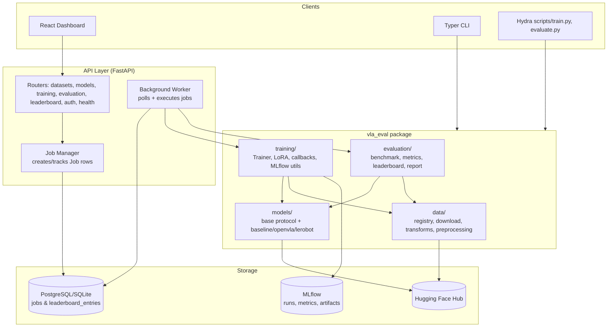

# Architecture

## Overview

VLA-Eval is organized as a single installable Python package (`vla_eval`) with clean separation between domain logic (data/models/training/evaluation), delivery mechanisms (CLI, API), and infrastructure (DB, MLflow, Docker/Kubernetes).

## Module responsibilities

| Module | Responsibility |
|---|---|
| `vla_eval.core` | Settings (`pydantic-settings`), structured logging (`structlog`), domain exceptions, small utils (seeding, device resolution, IO). |
| `vla_eval.data` | Dataset registry (curated `DatasetSpec` catalog), download (LeRobot-first, HF Hub fallback), transforms (image resize/normalize), preprocessing into `VLAEpisodeDataset`. |
| `vla_eval.models` | `BaseVLAModel`/`VLAPolicy` protocol; implementations for a CNN baseline, OpenVLA (transformers + optional 4-bit + LoRA), and LeRobot policies; factory registry (`create_model`). |
| `vla_eval.training` | `Trainer` (train/val loop, AdamW + OneCycleLR, checkpointing), `EarlyStopping`/`ModelCheckpoint` callbacks, LoRA application helper, MLflow tracking context manager. |
| `vla_eval.evaluation` | Offline/closed-loop benchmarking, action/latency metrics, composite scoring, leaderboard ranking, Markdown+chart report generation. |
| `vla_eval.api` | FastAPI app factory, versioned routers, SQLAlchemy models/engine, Pydantic schemas, API-key/JWT security, job manager + background worker services. |
| `vla_eval.cli` | Typer CLI exposing `data`, `train`, `evaluate`, `serve` commands for quick, config-light usage (Hydra scripts are used for full experiment-config control). |

## Data flow: training job lifecycle

1. Client (UI/CLI/API caller) submits a training request → `POST /api/v1/training/jobs`.
2. `job_manager.submit_training_job` inserts a `Job` row (`status=pending`) and returns immediately.
3. The background worker (`vla_eval.api.services.background_worker`, run via `make run-worker` or the `worker` container) polls for pending jobs (`claim_pending_job`, using `SELECT ... FOR UPDATE SKIP LOCKED` on Postgres, or a plain claim on SQLite).
4. The worker executes the job on a `ThreadPoolExecutor`, calling into `vla_eval.training.trainer.Trainer.fit`, which wraps the run in an MLflow run context, trains, checkpoints, and updates the `Job` row with progress/result.
5. Evaluation jobs follow the same pattern via `run_offline_benchmark`/`run_closed_loop_benchmark`, writing a `LeaderboardEntryDB` row on completion.
6. The dashboard and `/api/v1/leaderboard` read from the `leaderboard_entries` table.

## Why these technology choices

- **FastAPI + Pydantic v2**: async-friendly, strong typing/validation, automatic OpenAPI docs.
- **SQLAlchemy 2.0 (typed) + Alembic**: portable between SQLite (tests/local) and PostgreSQL (staging/production) with versioned migrations.
- **Hydra/OmegaConf**: composable experiment configuration for datasets/models/training/evaluation without hardcoding hyperparameters, supports multirun sweeps.
- **MLflow**: industry-standard experiment tracking; used as a library (not just a UI) via `mlflow_run` context manager.
- **Typer + Hydra split**: the CLI (`vla-eval`) gives simple, low-friction commands for common tasks; the Hydra scripts (`scripts/train.py`, `scripts/evaluate.py`) give full config composition/override power for research workflows.
- **structlog**: structured, JSON-renderable logs suitable for log aggregation in production, human-readable console output in development.
